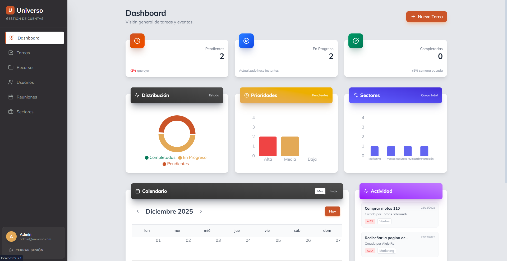

# Universo Automotores - Sistema de Gestión

Sistema integral para la gestión de cuentas, tareas y recursos internos de Universo Automotores.


*(Nota: Puedes agregar una captura de pantalla aquí)*

## 🚀 Tecnologías

### Frontend
- **React + Vite**: Framework principal.
- **Tailwind CSS**: Estilizado moderno y responsivo.
- **Lucide React**: Iconografía consistente.
- **Recharts**: Visualización de datos y métricas.
- **Axios**: Comunicación con el backend.

### Backend
- **Node.js + Express**: Servidor API RESTful.
- **TypeORM**: ORM para manejo de base de datos.
- **PostgreSQL**: Base de datos relacional.
- **JsonWebToken (JWT)**: Autenticación segura.

## 📋 Funcionalidades Principales

- **Dashboard Interactivo**: Métricas de tareas, carga de trabajo por sector y prioridades.
- **Gestión de Tareas**: Tablero Kanban (Pendiente, Progreso, Revisión, Completada) con comentarios y drag-and-drop.
- **Gestión de Sectores**: Administración de áreas (RRHH, Ventas, Admin) y sus empleados.
- **Reuniones**: Agenda de conferencias y reuniones de equipo con prevención de conflictos.
- **Recursos**: Repositorio de links y documentos útiles filtrados por rol.
- **Seguridad**: Roles de usuario (ADMINISTRADOR / EMPLEADO) y protección de rutas.

## 🛠️ Instalación y Configuración

### Prerrequisitos
- Node.js (v16+)
- PostgreSQL

### 1. Configuración del Backend

```bash
cd backend
npm install
```

Crea un archivo `.env` en la carpeta `backend` con las siguientes variables:

```env
PORT=3000
DB_HOST=localhost
DB_PORT=5432
DB_USERNAME=postgres
DB_PASSWORD=tu_password
DB_NAME=universo_db
JWT_SECRET=tu_secreto_super_seguro
```

Iniciar el servidor:

```bash
npm start
```

### 2. Configuración del Frontend

```bash
cd frontend
npm install
```

Iniciar la aplicación:

```bash
npm run dev
```

La aplicación estará disponible en `http://localhost:5173`.

## 🤝 Contribución

1. Fork del proyecto
2. Crear una rama (`git checkout -b feature/nueva-feature`)
3. Commit de cambios (`git commit -m 'Agrega nueva feature'`)
4. Push a la rama (`git push origin feature/nueva-feature`)
5. Abrir un Pull Request
